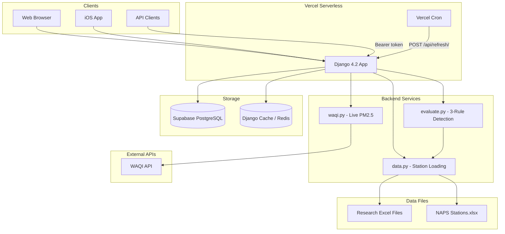
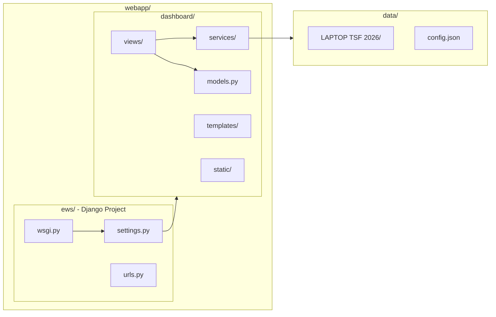
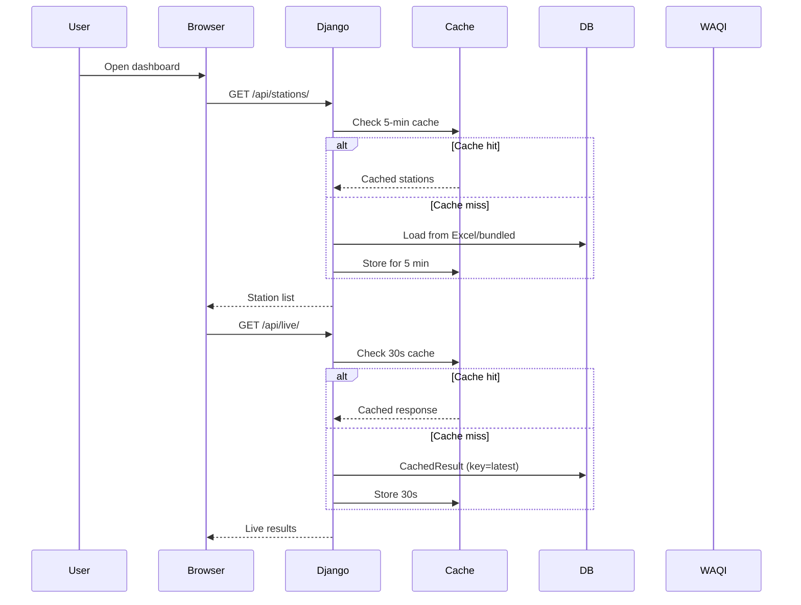
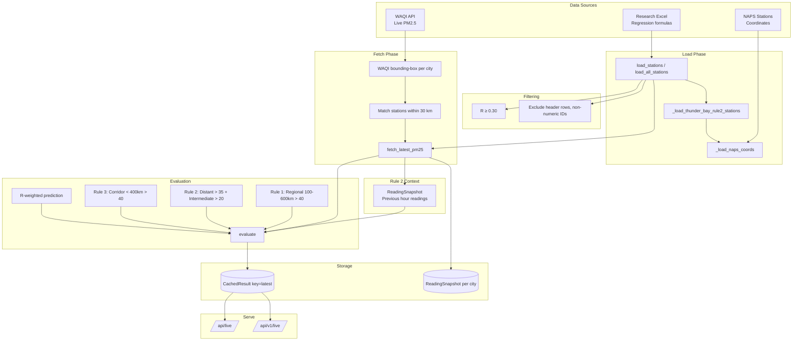
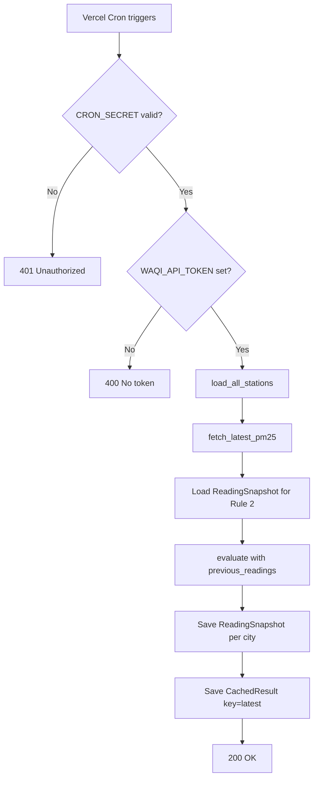
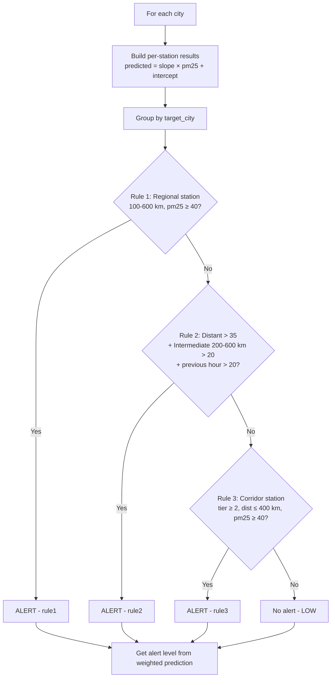
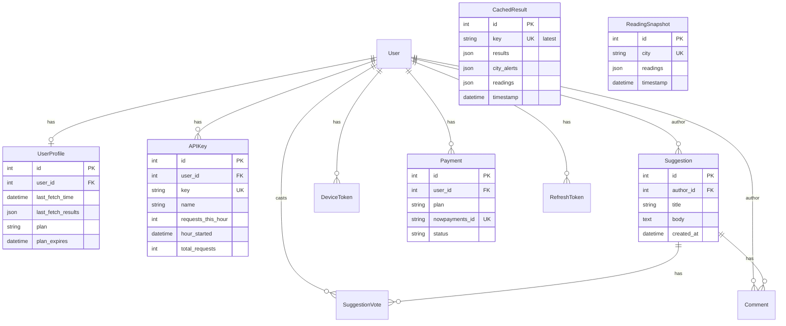

# C.L.E.A.R. — Canadian Lead-Time Early Air Response

<p align="center">
  <strong>A PM2.5 wildfire smoke early warning system</strong><br>
  Using air quality monitoring stations 100–600+ km away to provide <strong>6–48 hours of advance warning</strong> before dangerous smoke arrives in major Canadian cities.
</p>

**Source of truth:** [CLEAR_Methodology_ScienceFair Ver#1](data/LAPTOP%20TSF%202026/01.%20Summary%20Documents/CLEAR_Methodology_ScienceFair%20Ver%231.pdf)

**Authors:** Hugo Bui & Ryan Zander — University of Toronto Schools

**Live site:** [https://clear25.xyz](https://clear25.xyz)

---

## Table of Contents

- [Overview](#overview)
- [Architecture](#architecture)
- [Data Flow](#data-flow)
- [Three-Rule Detection System](#three-rule-detection-system)
- [Project Structure](#project-structure)
- [Database Schema](#database-schema)
- [API Reference](#api-reference)
- [Deployment](#deployment)
- [Setup](#setup)
- [Configuration](#configuration)
- [V2 Migration Plan](#v2-migration-plan)

---

## Overview

### Cities Covered

| City | Coordinates | Label |
|------|-------------|-------|
| Toronto | 43.7479, -79.2741 | Toronto |
| Montreal | 45.5027, -73.6639 | Montréal |
| Edmonton | 53.5482, -113.3681 | Edmonton |
| Vancouver | 49.3686, -123.2767 | Vancouver |

### How It Works

The system uses **simple linear regression models** between distant monitoring stations and target cities:

```
PM2.5_city = slope × PM2.5_station + intercept
```

When a remote station's PM2.5 reading exceeds a computed threshold, a colour-coded health alert is triggered **hours before** the smoke reaches the city.

### Alert Levels (per methodology Section 3)

| Level | PM2.5 (µg/m³) | Color | Action |
|-------|---------------|-------|--------|
| **LOW** | 0–20 | Green | No precautions needed |
| **MODERATE** | 21–60 | Yellow | Sensitive groups reduce outdoor activity |
| **HIGH** | 61–80 | Orange | Reduce exertion, wear N95, close windows, run HEPA |
| **VERY HIGH** | 81–120 | Red | Avoid all outdoor activity |
| **EXTREME** | > 120 | Dark red | Stay indoors, close windows, run HEPA, no indoor pollution sources |

### Validation (per methodology)

| Metric | Value |
|--------|-------|
| **Accuracy** | 90.9% |
| **Sensitivity** | 100% (zero missed events) |
| **Mean lead time** | 15.7 hours |
| **Maximum lead time** | 87 hours |
| **Study period** | 2003–2023, wildfire season (May–September) |
| **Data volume** | 36M+ hourly observations from NAPS and U.S. EPA networks |

### Station Selection Criteria (methodology Section 2.3)

- **R ≥ 0.30**, P < 0.001, N ≥ 100 observations
- Toronto reference: NAPS 60430 (primary), 60410 (secondary); highest-station approach
- **Rule 2 (NW Ontario):** Thunder Bay NAPS 60807, 60809 for sequential detection

---

## Architecture

### High-Level System Architecture



### Component Architecture



### Request Flow



---

## Data Flow

### End-to-End Data Pipeline



### Cron Refresh Flow (every 30 minutes)



---

## Three-Rule Detection System

Source: CLEAR_Methodology_ScienceFair Ver#1 (Sections 4–6)

### Rule Decision Flowchart



### Rule Summary Table

| Rule | Name | Trigger Condition | Stations |
|------|------|-------------------|----------|
| **Rule 1** | Regional Station Alert | Station 100–650 km, PM2.5 > 40 µg/m³ | Ontario/Quebec regional |
| **Rule 2** | NW Ontario Sequential | Distant (600+ km) > 35 + intermediate (200–600 km) > 20, both current & previous hour | Thunder Bay 60807, 60809 |
| **Rule 3** | Quebec Upstream | Corridor station < 400 km, PM2.5 > 40 µg/m³ | Quebec corridor |

### Key Constants (evaluate.py)

| Constant | Value | Description |
|----------|-------|--------------|
| `RULE1_TRIGGER` | 40 | Regional station threshold (µg/m³) |
| `RULE2_DISTANT_TRIGGER` | 35 | Thunder Bay / distant station trigger |
| `RULE2_INTERMEDIATE` | 20 | Intermediate confirmation threshold |
| `RULE3_CORRIDOR_TRIGGER` | 40 | Corridor station trigger |
| `CITY_ELEVATED_THRESHOLD` | 20 | City PM2.5 confirming smoke arrival |
| `EVALUATION_WINDOW_HOURS` | 120 | 5-day evaluation window |
| `EVENT_COOLDOWN_HOURS` | 168 | 7-day minimum between events |
| `CONFIRMATION_WINDOW_HOURS` | 96 | 4-day intermediate confirmation |

### R-Weighted Prediction

Stations with higher correlation (R-value) have more influence:

```
weight = max(R², 0.1)
weighted_prediction = Σ(weight × predicted) / Σ(weight)
```

---

## Project Structure

```
CLEAR25/
├── .cursorrules              # Project rules, data paths, git workflow
├── .gitignore
├── .vercelignore              # Excludes data/ (827 MB) from deployment
├── AGENTS.md                  # Architecture, commands, API docs (WARP)
├── README.md                  # This file
├── requirements.txt           # Root Python deps
├── build_files.sh             # Vercel build script
├── vercel.json                # Vercel config, cron, routes
│
├── app-icons/
│   ├── README.md
│   └── icon.svg
│
├── .github/workflows/
│   └── ios-build.yml          # Manual iOS build (Capacitor)
│
├── data/
│   ├── config.example.json    # WAQI API key template
│   ├── epa_station_coords.json
│   ├── aqs_sites_extracted.csv
│   └── LAPTOP TSF 2026/
│       ├── 01. Summary Documents/           # CLEAR_Methodology_ScienceFair Ver#1.pdf
│       ├── 03. RAW DATA PM25 CANADA+Provinces/  # Hourly PM2.5 (2003-2023)
│       ├── 05. NAPS Stations/               # Canada_NAPS_Stations_Active_Years.xlsx
│       ├── 07. The 4 Cities - Regression formulas and alert network stations/
│       │   ├── Toronto/
│       │   ├── Montreal/
│       │   ├── Edmonton/
│       │   └── Vancouver/
│       ├── 10. Validation/                  # SAQS Validation (2015-2023)
│       └── 13. AI regression example/
│
└── webapp/
    ├── manage.py             # Django entry point
    ├── requirements.txt      # Full deps (includes openpyxl)
    ├── requirements-vercel.txt  # Slim deps (uses bundled_stations.json)
    │
    ├── ews/                  # Django project
    │   ├── settings.py       # Config, env vars, database, caching
    │   ├── urls.py           # Root URL config
    │   └── wsgi.py           # Vercel entry point
    │
    └── dashboard/            # Main app
        ├── apps.py
        ├── models.py         # UserProfile, APIKey, CachedResult, etc.
        ├── urls.py           # App URL routing
        ├── jwt_auth.py       # JWT access/refresh tokens
        ├── push.py           # Push notifications
        │
        ├── services/
        │   ├── __init__.py
        │   ├── data.py       # Station loading, Excel parsing
        │   ├── evaluate.py   # 3-rule detection logic
        │   ├── waqi.py       # WAQI API client
        │   └── bundled_stations.json  # Fallback when data/ absent
        │
        ├── views/
        │   ├── core.py       # Dashboard, api_stations, api_live, api_refresh
        │   ├── api.py        # Public API v1
        │   ├── landing.py    # Landing, privacy
        │   ├── feedback.py   # Suggestion board
        │   ├── account.py    # Settings, profile
        │   ├── billing.py    # Subscriptions
        │   ├── keys.py       # API key management
        │   ├── tokens.py     # JWT endpoints
        │   ├── health.py     # Health check
        │   └── utils.py
        │
        ├── templates/dashboard/
        ├── static/dashboard/
        │   ├── app.js        # Main app logic
        │   ├── app-render.js # Dashboard rendering
        │   ├── app-map.js    # Leaflet map
        │   ├── app-feedback.js
        │   ├── app-keys.js
        │   ├── app-billing.js
        │   └── style.css
        │
        └── management/commands/
            └── validate_saqs.py  # SAQS validation report
```

### Explicit Data Paths (.cursorrules)

| Purpose | Path |
|---------|------|
| **Methodology** | `data/LAPTOP TSF 2026/01. Summary Documents/CLEAR_Methodology_ScienceFair Ver#1.pdf` |
| **Regression Excel** | `data/LAPTOP TSF 2026/07. The 4 Cities - Regression formulas and alert network stations/{City}/` |
| **Validation** | `data/LAPTOP TSF 2026/10. Validation/` |
| **Raw PM2.5 data** | `data/LAPTOP TSF 2026/03. RAW DATA PM25 CANADA+Provinces/` |
| **NAPS Stations** | `data/LAPTOP TSF 2026/05. NAPS Stations/04. Canada_NAPS_Stations_Active_Years.xlsx` |

---

## Database Schema



### Model Summary

| Model | Purpose |
|-------|---------|
| **UserProfile** | Plan (free/pro/business), last fetch, rate limits |
| **APIKey** | Public API keys, rate limiting per key |
| **CachedResult** | Latest evaluation (key='latest'); single row |
| **ReadingSnapshot** | Per-city readings for Rule 2 (previous hour) |
| **Suggestion** | User feedback board |
| **SuggestionVote** | Upvote/downvote on suggestions |
| **Comment** | Comments on suggestions |
| **DeviceToken** | Push notification tokens (iOS/Android) |
| **Payment** | NOWPayments crypto subscriptions |
| **RefreshToken** | JWT refresh token (hash stored) |

---

## API Reference

### Internal APIs (no API key)

| Method | Path | Purpose | Cache |
|--------|------|---------|-------|
| GET | `/api/stations/` | All stations grouped by city | 5 min |
| GET | `/api/demo/` | Simulated wildfire scenario | 5 min |
| GET | `/api/live/` | Latest cached results | 30s |
| POST | `/api/refresh/` | Cron refresh (Bearer CRON_SECRET) | — |
| GET | `/api/auth-status/` | Auth status | — |

### Public API v1 (requires `Authorization: Bearer <API_KEY_OR_JWT>`)

| Method | Path | Purpose |
|--------|------|---------|
| GET | `/api/v1/live/` | Current predictions; `?station=<id>` |
| GET | `/api/v1/stations/` | Station metadata; `?city=` |
| GET | `/api/v1/cities/` | City list |
| POST | `/api/v1/keys/create/` | Create API key |
| POST | `/api/v1/keys/revoke/` | Revoke API key |
| POST | `/api/v1/auth/token/` | JWT access token |
| POST | `/api/v1/auth/refresh/` | JWT refresh |
| POST | `/api/v1/auth/revoke/` | Revoke JWT |
| POST | `/api/v1/subscribe/` | Create payment |
| POST | `/api/v1/subscribe/webhook/` | NOWPayments webhook |
| GET | `/api/v1/subscribe/status/` | Subscription status |

### Plan Limits

| Plan | Rate limit | Max API keys |
|------|------------|--------------|
| Free | 100/hr | 1 |
| Pro | 1,000/hr | 5 |
| Business | 10,000/hr | 20 |

---

## Deployment

### Vercel Configuration

```mermaid
flowchart LR
    subgraph Build [Build]
        BuildCmd[build_files.sh]
        Pip[pip install requirements]
        Migrate[python manage.py migrate]
        Site[Site.objects.update_or_create]
        Static[collectstatic]
    end

    subgraph Deploy [Deploy]
        Python[@vercel/python]
        WSGI[ews/wsgi.py]
    end

    subgraph Cron [Cron]
        Refresh[/api/refresh/ every 30 min]
    end

    BuildCmd --> Pip --> Migrate --> Site --> Static
    Python --> WSGI
    Refresh -->|Bearer CRON_SECRET| WSGI
```

### Build Script (build_files.sh)

```bash
# On Vercel: use slim requirements (no openpyxl; bundled_stations.json)
# Locally: full requirements with openpyxl
pip install -r webapp/requirements-vercel.txt  # or requirements.txt
cd webapp && python manage.py migrate --noinput
python manage.py shell -c "Site.objects.update_or_create(...)"
python manage.py collectstatic --noinput
```

### Vercel Cron

- **Path:** `/api/refresh/`
- **Schedule:** `*/30 * * * *` (every 30 minutes)
- **Auth:** `Authorization: Bearer ${CRON_SECRET}`

---

## Setup

### Prerequisites

- Python 3.10+
- pip

### Quick Start

```bash
pip install -r requirements.txt
cd webapp
python manage.py migrate
python manage.py runserver
```

Open http://127.0.0.1:8000/

### Create Site (for allauth)

```bash
cd webapp && python manage.py shell -c "from django.contrib.sites.models import Site; Site.objects.update_or_create(id=1, defaults={'domain': 'localhost:8000', 'name': 'C.L.E.A.R.'})"
```

### Validate SAQS

```bash
cd webapp && python manage.py validate_saqs
```

---

## Configuration

### Environment Variables

| Variable | Purpose | Required |
|----------|---------|----------|
| `SECRET_KEY` | Django secret | Production |
| `DEBUG` | Debug mode | — |
| `DATABASE_URL` | PostgreSQL (Supabase) | Production |
| `WAQI_API_TOKEN` | WAQI API key | Production refresh |
| `CRON_SECRET` | Auth for `/api/refresh/` | Production cron |
| `REDIS_URL` | Redis for cache | Optional |
| `GOOGLE_CLIENT_ID` | Google OAuth | Optional |
| `GOOGLE_CLIENT_SECRET` | Google OAuth | Optional |
| `NOWPAYMENTS_*` | Crypto billing | Optional |
| `ALLOWED_HOSTS` | Comma-separated hosts | Optional |
| `CSRF_TRUSTED_ORIGINS` | CORS origins | Optional |

### Config File (optional)

Create `data/config.json` (copy from `data/config.example.json`):

```json
{
    "api_key": "YOUR_WAQI_API_KEY_HERE"
}
```

The app prefers `WAQI_API_TOKEN` env var over `config.json`.

---

## Features

| Feature | Description |
|---------|-------------|
| **Dashboard** | Real-time alert banner, station table, stats cards |
| **Live Map** | Interactive Leaflet map with station markers and alert colours |
| **Research** | Full research content including methodology, validation |
| **Demo Mode** | Simulated wildfire scenarios for each city |
| **Auto-fetch** | Live data on load and every 15 minutes |
| **Feedback** | Suggestion board with voting and comments |
| **API** | Public API v1 with JWT and API key auth |
| **Billing** | NOWPayments crypto subscriptions |

---

## Data Sources

| Source | Purpose |
|--------|---------|
| **NAPS** | National Air Pollution Surveillance Program (Environment Canada) |
| **U.S. EPA AQS / AirNow** | Border station data |
| **WAQI** | World Air Quality Index API for live PM2.5 |

---

## V2 Migration Plan

A full rewrite plan exists at `.cursor/plans/clear25_v2_safe_migration_e69a4963.plan.md`.

### Stack Comparison

| Layer | V1 (Current) | V2 (Planned) |
|-------|---------------|--------------|
| Framework | Django | Next.js 14 (App Router) |
| Language | Python | TypeScript |
| API | Django views | tRPC + API v1 compat |
| ORM | Django ORM | Prisma |
| Auth | django-allauth + JWT | NextAuth + JWT |
| Styling | Tailwind + vanilla JS | Tailwind + React |
| Deploy | Vercel Python | Vercel (native Next.js) |

### Key V2 Features

- Open-Meteo PM2.5 fallback when WAQI empty
- Responsive redesign, dark mode, favorite cities
- Historical trends (7-day PM2.5), event history
- Accuracy dashboard, methodology explorer
- API v2, webhooks, interactive API docs
- Offline support, skeleton loading

### Migration Strategy

1. Build V2 in parallel (v2.clear25.xyz)
2. Same Supabase database (no data migration)
3. API v1 identical JSON responses for existing clients
4. Cutover: point clear25.xyz to Next.js when ready
5. Rollback: revert DNS/config to Django if needed

---

## Discoveries & Errors (.cursorrules)

| Issue | Resolution |
|-------|------------|
| **Research Excel structure** | Single sheet, headers row 4; columns: Station ID, City, Distance, Direction, Tier, R, Slope, Intercept. Coords from NAPS file. |
| **Station filtering** | R ≥ 0.30; skip non-numeric IDs (e.g. "Rule 3 Québec Stations"). |
| **Thunder Bay (Rule 2)** | NAPS 60807, 60809 injected into Toronto; coords from NAPS; trigger-only (>35 µg/m³); weak correlation per methodology. |

---

## License & Authors

**C.L.E.A.R.** — Canadian Lead-Time Early Air Response

- **Authors:** Hugo Bui & Ryan Zander
- **Institution:** University of Toronto Schools
- **Methodology:** CLEAR_Methodology_ScienceFair Ver#1
